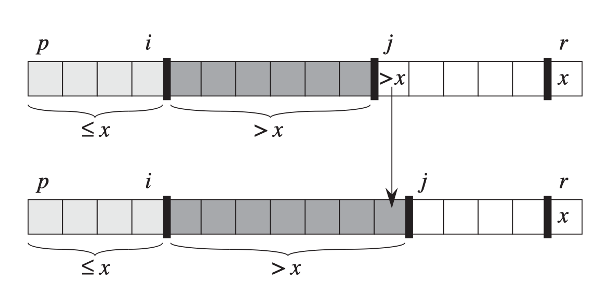

#

理解: 
每次排序，给一个序列A，最左侧索引是p，最右侧索引是r。
x选择最后一个元素A[r]。
将数组分成三部分:



1. [p, i] 这部分<=x, 开始时为空，此时i=p-1

2. (i, j) 这部分>x

3. [j, r-1] 这部分未知, 开始时j=p

所以目的就是将[j, r-1]置空，然后交换i+1与r未知的数据。

伪代码:
```
QUICKSORT(A, p, r)
    if p<r
        mid=PARTITION(A, p, r)
        QUICKSORT(A, p, mid-1)
        QUICKSORT(A, mid+1, r)

PARTITION(A, p, r)
    x=A[r]
    i=p-1
    for j=p to r-1
        if A[j]<=x
            i=i+1
            exchange A[i] with A[j]
    i=i+1
    exchange A[i] with A[r]
    return i

```

